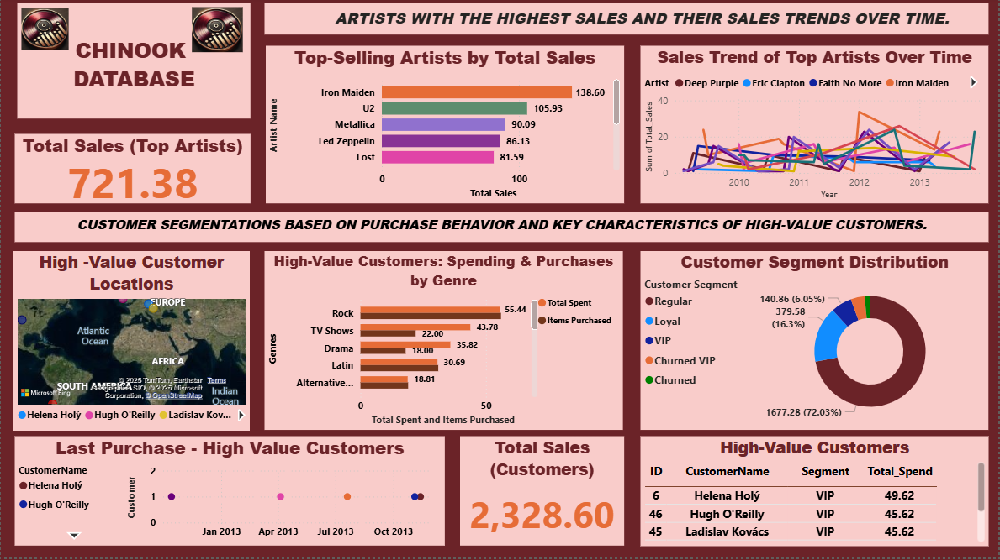

# 🎵 Music Sales Analytics & CLTV Prediction – Chinook Dataset

## 📘 Overview

This project analyzes customer purchasing behavior and sales data from the Chinook music store database using Power BI and machine learning techniques to derive insights and predict Customer Lifetime Value (CLTV).

---

## 🎯 Business Use Cases Addressed

## 📊 Power BI Dashboard Preview




### 📊 Descriptive Analytics (Power BI Dashboard)

**Page 1**

* 🎤 **Top-Selling Artists** – Identify artists with the highest sales and analyze their trends.
* 👥 **Customer Purchase Patterns** – Segment customers based on purchase behavior and identify high-value characteristics.

**Page 2**

* 🎼 **Genre Popularity** – Determine the most popular genres and how they change over time.
* 🗓 **Sales Over Time** – Analyze monthly/yearly sales trends and seasonal effects.

**Page 3**

* 💰 **Customer Lifetime Value (CLTV)** – Estimate and visualize customer value.
* 🛂 **Market Basket Analysis** – Discover common combinations of tracks or albums purchased together.

📋 **Screenshots available in `/Screenshots` folder** (with visualizations for the Power BI dashboards).

---

## 📂 SQL Feature Engineering

A comprehensive SQL query was developed to engineer features needed for CLTV modeling. These include:

* **Top genre per customer**
* **Total number of genres purchased**
* **Customer tenure and recency**
* **Purchase frequency**
* **Country and email domain**
* **Total revenue per customer (CLTV)**


---

## 🤖 Predictive Modeling: Customer Lifetime Value (CLTV)

### 🔧 Modeling Approach

1. **Data Preparation:**
   - Applied `log1p` transformation to reduce skewness in the CLTV column.
   - Dropped multicollinear features (e.g., `PurchaseFrequency`).
   - Grouped rare `EmailDomain` and `Country` values into 'Other' to reduce noise and improve model generalization.

2. **Models Tried:**
   - **Linear Regression**
   - **Random Forest Regressor**
   - **Gradient Boosting Regressor**

### 🔄 Iterative Model Refinement

- **Initial results:** All models showed negative R² scores (indicating poor predictive performance).
- **Model refinement:** By grouping sparse categorical values and selecting top features, performance improved.

### 🔢 Final Model: Linear Regression (Selected)

* ✅ **Best R² Score:** **0.3119** after refining and selecting top 15 features.
* **Reason for Selection:** Chosen for its balance of interpretability, generalization, and performance.
* **Feature Importance:** Used to inform dimensionality reduction, leading to a more reliable model.

📄 Full report and code in `cltv_modeling.ipynb` under `/CLTV_Model` folder

---

## 📁 Project Structure

```
/Business_Analysis/         → Jupyter notebook with SQL-based business analysis  
/CLTV_Model/                → Jupyter notebook for Customer Lifetime Value prediction (SQL + ML), the saved model 
                              (clv_model.pkl) and scaler (scaler.pkl) for easy reuse
/PowerBI_Dashboard/         → .pbix file containing interactive dashboards
/Power_Point/               → PowerPoint presentation summarizing insights and CLV predictions.
/Screenshots/               → Power Bi dashboard images  
README.md                   → Project overview and instructions

```

---

## 🛠️ How to Run (Optional)

1. **Business Analysis:**
   - Clone the repository to your local machine.
   - Open the `business_analysis.ipynb` notebook (located in the `/Business_Analysis/` folder) to execute SQL queries and perform the business analysis.
   - The notebook contains queries to generate insights on top-selling artists, genre popularity, sales over time, and customer purchase patterns.
   - Once you run the queries, you can visualize the results using Power BI dashboards (for detailed exploration).

2. **CLTV Model:**
   - Open the `cltv_modeling.ipynb` notebook (located in the `/CLTV_Model/` folder) for Customer Lifetime Value prediction.
   - Run all cells in the notebook to execute the SQL queries, perform data preparation, and train the machine learning models (Linear Regression, Random Forest, and Gradient Boosting).
   - Full modeling pipeline and results are available in this notebook, including feature engineering and iterative model improvements.
   - For visualization of the CLTV model, refer to the `/PowerBI_Dashboard/` folder (optional).

3. **Power Point:**
   - Open the `Power_Point_Presentation` file (located in the `/Power_Point/` folder) for presentation summarizing insights and CLV predictions.

4. **Power BI Dashboard:**
   - Open `PowerBI_Dashboard.pbix` in Power BI Desktop to explore interactive visualizations and gain insights into the business analysis.
   - Dashboards include sections on top-selling artists, genre popularity, customer purchase patterns, sales over time, etc.

---

---

## 📨 Contact

For any questions or feedback, reach out to \[NWOKIKE CHIAGOZIE] at \[[chiagozienwokike@gmail.com](mailto:your_email@example.com)].
